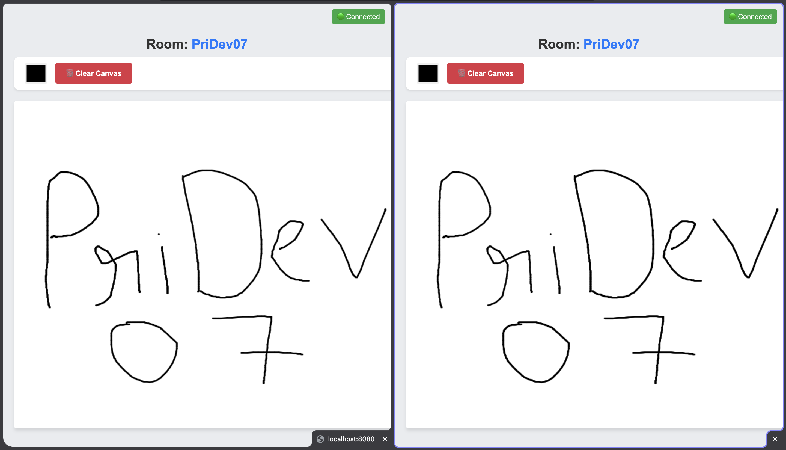

# Go Real-Time Collaborative Canvas 🎨

A high-concurrency, real-time, room-based collaborative whiteboard built with Go and WebSockets. This project demonstrates backend architecture patterns for managing multiple isolated real-time socket sessions securely, efficiently, and at scale.

## 🚀 Features



- **High-Concurrency Engine:** Uses Go routines and buffered channels (the *Hub/Room* pattern) to ensure that slow clients never block the server.
- **Room-Based Architecture:** Users can join isolated room instances (e.g., "Room A" and "Room B") where strokes and history are broadcast only to the participants of that specific lobby.
- **Canvas History State:** The backend persists stroke history in memory. Late joiners to a room instantly receive the full current state of the canvas dynamically.
- **Zero-Dependency Frontend:** The UI is crafted in vanilla HTML, JS (Canvas API), and CSS.
- **Clean Architecture:** Organized applying standard Go project layout conventions (`cmd/`, `internal/`, `public/`).

## 📁 Project Structure

```bash
.
├── cmd/
│   └── server/
│       └── main.go         # Application entrypoint & HTTP routes
├── internal/
│   ├── models/
│   │   └── models.go       # Core data structures (DrawEvents)
│   └── ws/
│       ├── client.go       # WebSocket Client wrappers, ReadPump & WritePump
│       ├── manager.go      # Global Server Room Manager
│       └── room.go         # Room-specific multiplexing Hub & Broadcaster
└── public/
    └── index.html          # Vanilla JS Canvas Frontend
```

## 🛠️ Prerequisites

To run this project locally, you will need:

- **Go** (version 1.20+) installed on your machine. [Download Go](https://go.dev/dl/)

## 🏎️ Getting Started

1. **Clone the repository:**

   ```bash
   git clone https://github.com/yourusername/websockets_practise.git
   cd websockets_practise
   ```
2. **Download dependencies:**
   We use `github.com/gorilla/websocket` for our socket upgrader.

   ```bash
   go mod tidy
   ```
3. **Run the server:**
   Start the application entrypoint.

   ```bash
   go run cmd/server/main.go
   ```

   You should see: `High-Concurrency Room-Based Canvas Server Started at: http://localhost:8080`
4. **Experience the magic:**

   - Open your browser and navigate to [http://localhost:8080](http://localhost:8080).
   - Enter a Room Name (e.g., `Alpha`) and join.
   - Open up **another tab/window** and join the same room. Start drawing and see it sync flawlessly!
   - Try opening a third tab joining a different room (e.g., `Beta`). You will notice they are completely isolated, providing a clean slate canvas workspace.

## 🧠 Architectural Highlights

In standard looping WebSocket servers, writing to clients happens under a `sync.Mutex`. If one user has a terrible network connection, it lags the whole loop for everyone else!

To overcome this, this application uses **Channel Multiplexing (Event Loop)**:

- `ReadPump` routines endlessly read data and pass them into a non-blocking `r.broadcast` channel.
- A singular `room.run()` routine acts as an event selector.
- `WritePump` independently grabs messages designated to the user, bundling rapid-fire strokes neatly into singular TCP frames to avoid TCP congestion overhead.

---

> Built for practicing High-Concurrency WebSocket architectures in Golang!
